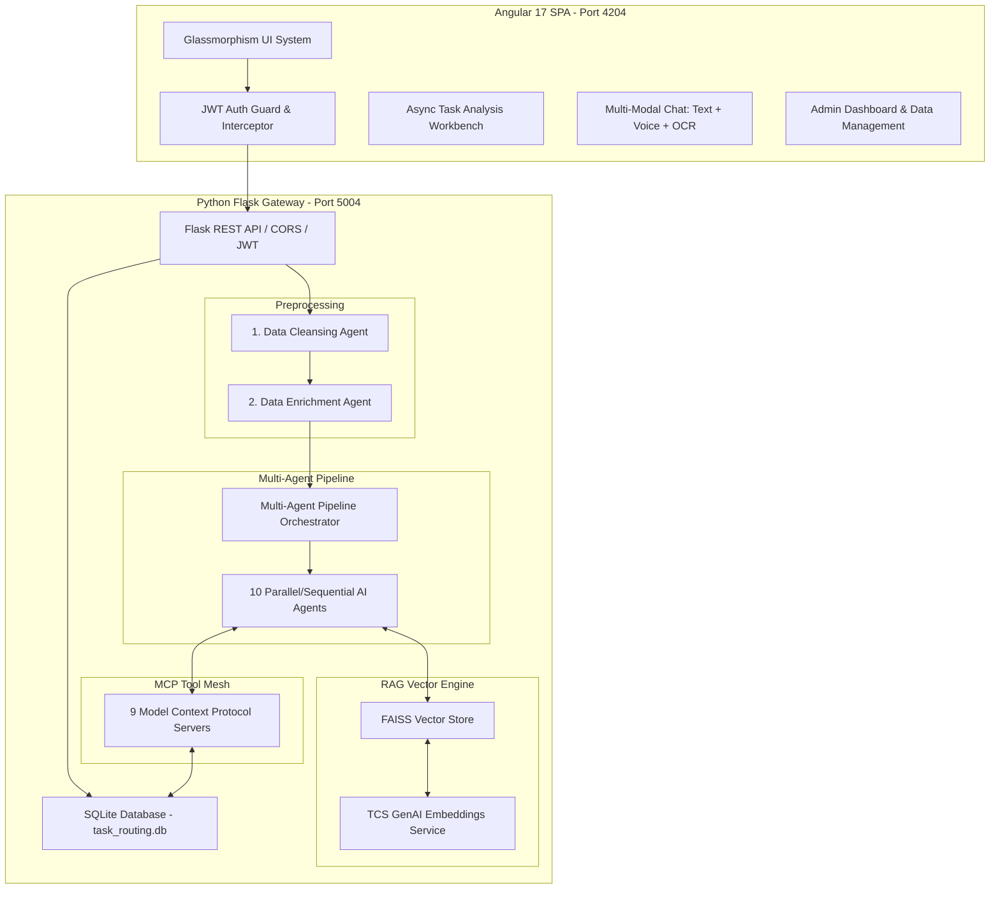
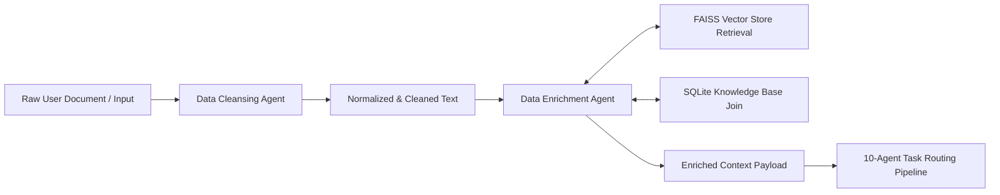

# TCS Hackathon Master Blueprint: Angular 17 + Python Flask AI Engine

This skill provides a complete, reusable architecture blueprint for TCS Hackathons (AI Friday, Innovate, etc.). It enables rapid adaptation to **any problem statement** while enforcing enterprise-grade AI patterns, UI design consistency, and robust backend engineering.

---

## 🏛️ 1. Architecture Overview & Core Stack



### Key Technical Specifications
- **Frontend**: Angular 17 SPA with RxJS, HttpClient, Angular Material & Custom Glassmorphism CSS (`frontend-task-glass`).
- **Backend Gateway**: Python 3.10+ Flask REST API (`backend-mcp-task`) running on port `5004`.
- **Database**: SQLite (`data/task_routing.db`) with JWT token authentication.
- **RAG Engine**: FAISS vector index + `langchain_openai.OpenAIEmbeddings` adapted for TCS GenAI Lab endpoints.
- **MCP Servers**: 9 modular REST/JSON tool servers providing standardized data interfaces.
- **AI Agents**: 10 autonomous agents executing sequential document decomposition and parallel resource/cost/risk evaluation.
- **Multi-Modal Assistant**: Web Speech API (STT & TTS) with PAS 901 adaptive chunking and Tesseract / OCR image ingestion.

---

## 🔐 2. Database & Authentication Blueprint (SQLite + JWT)

### SQLite Schema (`backend-mcp-task/database.py`)
Ensure the following core tables are initialized on startup:

```python
import sqlite3

def init_database():
    conn = sqlite3.connect("data/task_routing.db")
    cursor = conn.cursor()

    # 1. Users Table (Authentication)
    cursor.execute('''
        CREATE TABLE IF NOT EXISTS users (
            id INTEGER PRIMARY KEY AUTOINCREMENT,
            username TEXT UNIQUE NOT NULL,
            password_hash TEXT NOT NULL,
            role TEXT DEFAULT 'user',
            created_at TIMESTAMP DEFAULT CURRENT_TIMESTAMP
        )
    ''')

    # 2. Resources Table (Human & AI Agents)
    cursor.execute('''
        CREATE TABLE IF NOT EXISTS resources (
            id INTEGER PRIMARY KEY AUTOINCREMENT,
            name TEXT NOT NULL,
            type TEXT CHECK(type IN ('human', 'ai_agent')),
            role TEXT NOT NULL,
            skills TEXT NOT NULL,  -- JSON string array
            hourly_rate REAL NOT NULL,
            max_capacity INTEGER NOT NULL,
            current_workload INTEGER DEFAULT 0,
            availability_status TEXT DEFAULT 'available'
        )
    ''')

    # 3. Knowledge Base Table (For RAG Enrichment)
    cursor.execute('''
        CREATE TABLE IF NOT EXISTS knowledge_base (
            id INTEGER PRIMARY KEY AUTOINCREMENT,
            title TEXT NOT NULL,
            document_type TEXT NOT NULL,
            content TEXT NOT NULL,
            tags TEXT,
            created_at TIMESTAMP DEFAULT CURRENT_TIMESTAMP
        )
    ''')

    conn.commit()
    conn.close()
```

### JWT Authentication Interceptor (Angular)
In `frontend-task-glass/src/app/services/auth.interceptor.ts`:

```typescript
import { Injectable } from '@angular/core';
import { HttpRequest, HttpHandler, HttpEvent, HttpInterceptor } from '@angular/common/http';
import { Observable } from 'rxjs';

@Injectable()
export class JwtInterceptor implements HttpInterceptor {
  intercept(request: HttpRequest<any>, next: HttpHandler): Observable<HttpEvent<any>> {
    const token = localStorage.getItem('token');
    if (token) {
      request = request.clone({
        setHeaders: { Authorization: `Bearer ${token}` }
      });
    }
    return next.handle(request);
  }
}
```

---

## 🧹 3. Preprocessing: Data Cleansing & Data Enrichment Pipeline

Before invoking decision synthesis or final classification, raw inputs **must** pass through the preprocessing stage:



### 1. Data Cleansing Agent (`agents/data_cleansing_agent.py`)
- Removes boilerplate text, special characters, and formatting artifacts.
- Standardizes date formats, currency symbols, and priority keywords.
- Classifies section headers (e.g., Requirements, Deadlines, Skill Constraints).

### 2. Data Enrichment Agent (`agents/data_enrichment_agent.py`)
- Takes cleaned sections and queries the FAISS vector database for relevant company policies, past project metrics, and domain SOPs.
- Joins vector search results with relational metadata from SQLite.
- Attaches retrieved context to the document payload for subsequent agents.

---

## 🤖 4. Multi-Agent Pipeline & Asynchronous Execution

### The 10 AI Agents

| # | Agent Name | Primary Responsibility | Input $\rightarrow$ Output |
|---|---|---|---|
| 1 | **Document Analysis Agent** | Parse structure and extract text sections | Raw PDF/DOCX/TXT $\rightarrow$ Structural JSON |
| 2 | **Data Cleansing Agent** | Normalize, sanitize, and validate input text | Structural JSON $\rightarrow$ Cleaned JSON |
| 3 | **Task Classification Agent** | Decompose complex specs into atomic tasks | Cleaned Text $\rightarrow$ Classified Task Array |
| 4 | **Data Enrichment Agent** | Retrieve contextual domain knowledge via RAG | Task Array $\rightarrow$ Enriched Tasks + RAG Context |
| 5 | **Resource Matching Agent** | Match required skills with human & AI agents | Enriched Tasks $\rightarrow$ Ranked Resource Candidates |
| 6 | **Workload Optimization Agent** | Evaluate capacity and balance resource load | Resource Candidates $\rightarrow$ Workload Allocation Plan |
| 7 | **Cost Optimization Agent** | Calculate human vs AI cost trade-offs | Allocation Plan $\rightarrow$ Financial Cost Estimate |
| 8 | **Risk & SLA Agent** | Predict SLA compliance and operational risk | Cost Plan $\rightarrow$ Risk Rating & SLA Matrix |
| 9 | **Decision Synthesis Agent** | Consolidate optimal routing decision | All Agent Outputs $\rightarrow$ Master Routing Scheme |
| 10| **Summary Agent** | Generate executive summary & action items | Master Scheme $\rightarrow$ Executive Briefing |

### Asynchronous Data Streaming Endpoint (`app.py`)
To keep the UI responsive, stream progress step-by-step:

```python
@app.route('/api/task-routing/analyze-stream', methods=['POST'])
@jwt_required()
def analyze_stream():
    data = request.get_json()
    doc_text = data.get('document_text', '')

    def generate_events():
        orchestrator = AgentOrchestrator()
        for step_update in orchestrator.execute_pipeline_iterative(doc_text):
            yield f"data: {json.dumps(step_update)}\n\n"

    return Response(stream_with_context(generate_events()), content_type='text/event-stream')
```

---

## 🔌 5. Model Context Protocol (MCP) Server Mesh

Expose database operations and domain logic via standard MCP endpoints (`/api/mcp/<server>/<tool>`):

```python
# mcp_servers/resource_management.py
from flask import Blueprint, jsonify, request
import database

resource_server = Blueprint('mcp_resource', __name__)

@resource_server.route('/get_available_resources', methods=['GET'])
def get_available_resources():
    conn = database.get_connection()
    resources = conn.execute("SELECT * FROM resources WHERE availability_status = 'available'").fetchall()
    conn.close()
    return jsonify({"success": True, "data": [dict(r) for r in resources]})

@resource_server.route('/match_skills', methods=['POST'])
def match_skills():
    req_skills = request.json.get('required_skills', [])
    # Perform vector or SQL match logic
    return jsonify({"success": True, "matches": matched_resources})
```

---

## 🌐 6. TCS GenAI API Integration Patterns

### 1. SSL Proxy Bypass & HTTP Configuration
Inside internal TCS environments, configure `httpx` or `requests` to disable SSL verification and set custom timeouts:

```python
import os
import httpx
from langchain_openai import OpenAIEmbeddings
from config import Config

class TCSGenAIEmbeddings(OpenAIEmbeddings):
    def __init__(self, **kwargs):
        timeout = httpx.Timeout(60.0, connect=60.0, read=120.0)
        client = httpx.Client(verify=False, timeout=timeout)
        
        model_name = getattr(Config, "EMBEDDING_MODEL", "azure/genailab-maas-text-embedding-3-large")
        
        super().__init__(
            model=model_name,
            openai_api_key=Config.GENAI_API_KEY,
            openai_api_base=Config.GENAI_BASE_URL,
            http_client=client,
            **kwargs
        )
```

### 2. `.env` Environment Setup
```ini
HF_TOKEN=your_tcs_genai_api_key
JWT_SECRET_KEY=tcs-ai-friday-hackathon-key
GENAI_BASE_URL=https://genailab.tcs.in/
CHAT_MODEL=azure/genailab-maas-gpt-4o
EMBEDDING_MODEL=azure/genailab-maas-text-embedding-3-large
```

---

## 🗣️ 7. Frontend Multi-Modal Chat & Adaptive Chunking (PAS 901)

### Conversational Voice & OCR Assistant Features
- **Text Chat**: Standard conversational interface querying MCP tools.
- **Voice STT / TTS**: Web Speech API integration (`webkitSpeechRecognition` & `speechSynthesis`).
- **PAS 901 Adaptive Information Chunking**:
  1. Segments long LLM responses into micro-chunks (1-2 sentences).
  2. Plays chunk audio with text highlighting.
  3. Displays confirmation prompts: *"Does this make sense? [Next] [Replay] [Simplify]"*.
- **Image OCR**: Ingests uploaded image files (PNG/JPG), extracts text using Tesseract OCR, and forwards text to the task analysis pipeline.

---

## 🚀 8. Rapid Hackathon Adaptation Checklist (< 30 Mins)

When handed a **new problem statement** at a TCS Hackathon:

1. **Keep Framework intact**: Leave `frontend-task-glass` and `backend-mcp-task` folder structures untouched.
2. **Update Domain Schema**:
   - Edit `database.py` tables to match the new problem domain (e.g., patients, policies, inventory, claims).
3. **Customize Agents**:
   - Update agent prompts in `backend-mcp-task/agents/` (e.g., change `task_classification_agent.py` to `medical_triage_agent.py` or `claim_audit_agent.py`).
4. **Load Domain Knowledge for RAG**:
   - Place sample PDF/TXT domain documents in `data/` and run vector ingestion to update the FAISS index.
5. **Run Setup Scripts**:
   - Backend: `cd backend-mcp-task && setup.bat && start.bat`
   - Frontend: `cd frontend-task-glass && setup.bat && start.bat`
6. **Verify UI**: Open `http://localhost:4204` to present the solution with Glassmorphism visuals, multi-agent async progress, charts, and voice assistant.
