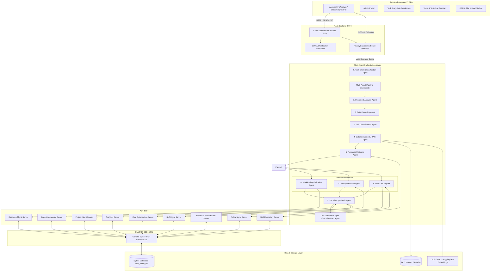
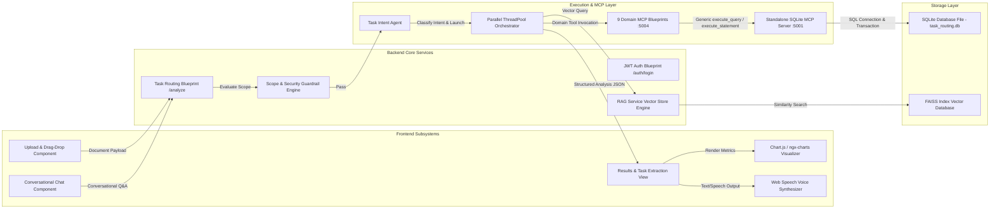
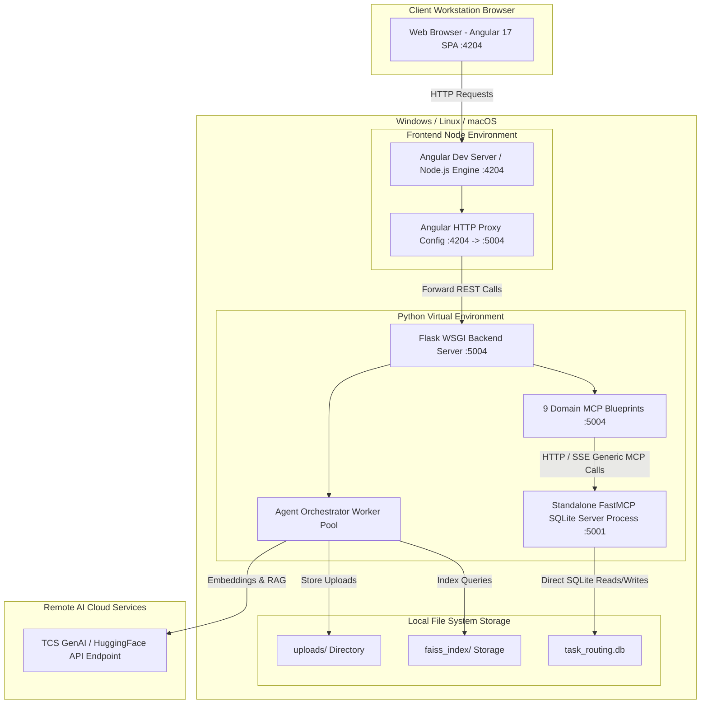
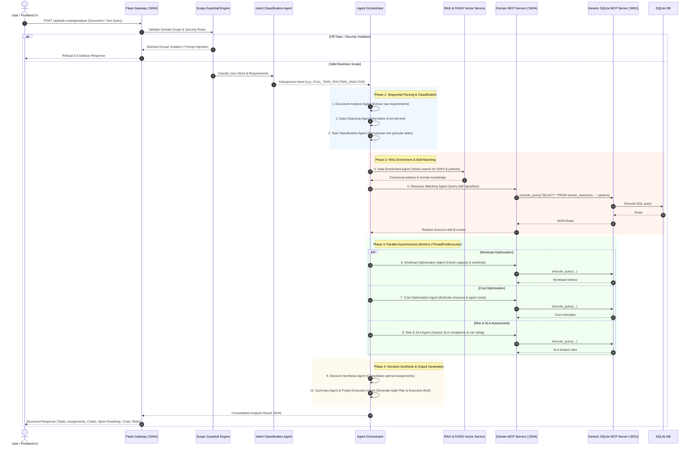
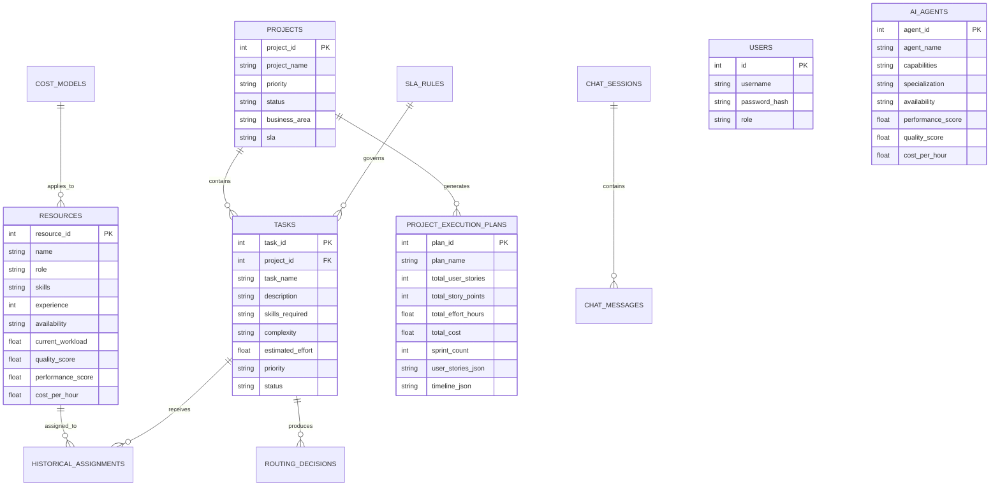

# System Architecture & Technical Specifications

## Intelligent Task Routing & Information Chunking System

---

## 1. Executive Summary & System Overview

The **Intelligent Task Routing System** is an enterprise-grade AI solution developed for the TCS AI Friday Challenge. It combines **Multi-Agent AI Orchestration**, **Model Context Protocol (MCP)** servers (including an independent, reusable **Generic SQLite MCP Server**), and **Retrieval-Augmented Generation (RAG)** to automatically analyze project requirements documents, classify tasks, optimize resource allocations (human experts & AI agents), evaluate cost/SLA risks, generate Agile User Stories & 3-Sprint Execution Plans, and provide conversational voice/text assistance with adaptive information chunking.

### Key Architectural Highlights
* 🛡️ **Two-Tier Scope & Intent Validation**: Input is evaluated by `PrivacyGuardrail.validate_scope` for security rules (prompt injection, jailbreak, toxicity, SQL injection, PII masking, rate limiting) and business domain scope. If off-topic, a polite guidance response is immediately returned to the UI. Valid inputs are processed by `TaskIntentAgent` to dynamically route requests.
* ⚡ **Asynchronous Parallel Agent Pipeline**: `AgentOrchestrator` dynamically selects specialist agents based on business intent and executes independent agents (`WorkloadOptimizationAgent`, `CostOptimizationAgent`, `RiskSLAAgent`) asynchronously in parallel using `ThreadPoolExecutor`.
* 🔌 **Standalone Generic SQLite MCP Server (`:5001`)**: Independent FastMCP server process running on port `5001` (SSE transport) providing application-agnostic database tools (`execute_query`, `execute_statement`, `execute_batch`, `list_tables`, `describe_table`). Has zero domain business logic and can be reused for any SQLite database across external applications.
* 🧩 **Domain MCP Server Mesh (`:5004`)**: 9 specialized Flask Blueprint tool servers (`resource`, `skill`, `policy`, `expert`, `performance`, `sla`, `cost`, `project`, `analytics`) that process domain operations and execute SQL via the generic SQLite MCP execution engine.

---

## 2. High-Level System Architecture (System Context)

---

## 3. Data Flow & Subsystem Interaction Architecture (C4 Level 2)

---

## 4. Infrastructure & Deployment Topology Diagram

---

## 5. Multi-Agent Execution Sequence Flow

---

## 6. Model Context Protocol (MCP) Server Specification

| MCP Server | Hosting / Port | Capabilities & Exposed Tools |
| :--- | :--- | :--- |
| **Generic SQLite MCP Server** | Standalone FastMCP (`:5001`) | `execute_query` (SELECT), `execute_statement` (INSERT/UPDATE/DELETE/DDL), `execute_batch` (transactions), `list_tables`, `describe_table` |
| **Resource Management** | Flask Blueprint (`:5004`) | `get_available_resources`, `get_current_workload`, `get_resource_skills`, `get_resource_capacity` |
| **Skill Repository** | Flask Blueprint (`:5004`) | `search_skills`, `match_skills`, `get_skill_profiles` |
| **Policy Management** | Flask Blueprint (`:5004`) | `search_policies`, `get_business_rules`, `get_escalation_rules` |
| **Expert Knowledge** | Flask Blueprint (`:5004`) | `search_expert_recommendations`, `get_historical_guidance`, `get_expert_by_category` |
| **SLA Management** | Flask Blueprint (`:5004`) | `get_sla_requirements`, `predict_breach_risk`, `check_sla_compliance` |
| **Cost Optimization** | Flask Blueprint (`:5004`) | `estimate_assignment_cost`, `compare_assignment_options`, `get_cost_optimization_recommendations` |
| **Historical Performance** | Flask Blueprint (`:5004`) | `get_historical_assignments`, `get_success_rates`, `get_quality_scores` |
| **Project Management** | Flask Blueprint (`:5004`) | `get_project_details`, `get_project_status`, `get_task_information`, `get_tasks_by_status` |
| **Analytics** | Flask Blueprint (`:5004`) | `find_similar_tasks`, `recommend_best_resource`, `generate_utilization_metrics` |

---

## 7. Database Entity Relationship Diagram

