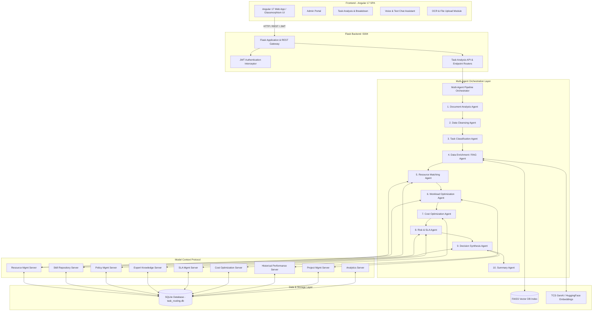
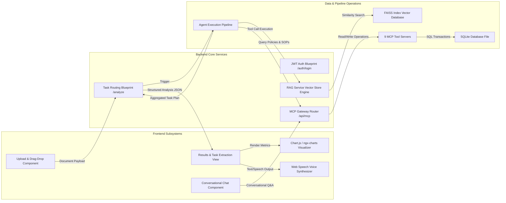
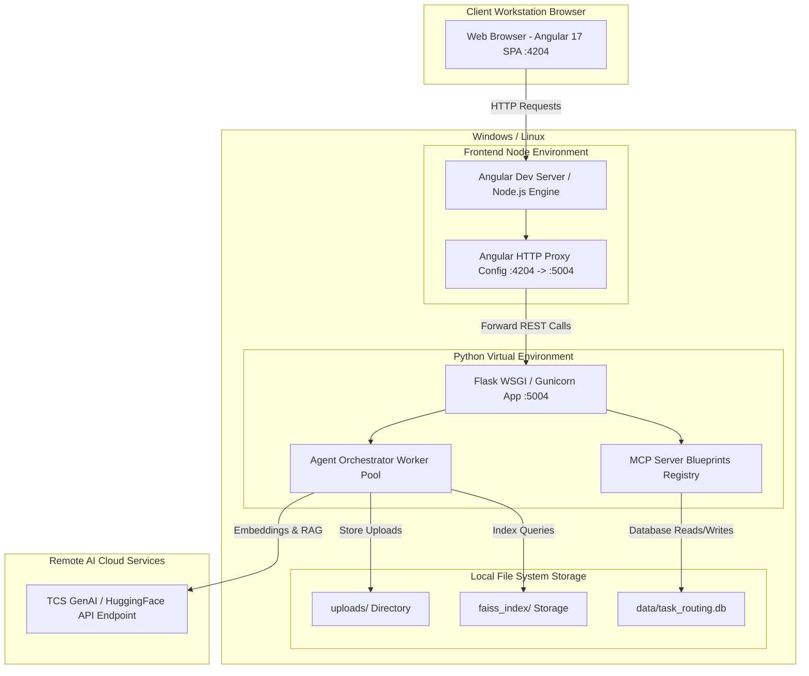
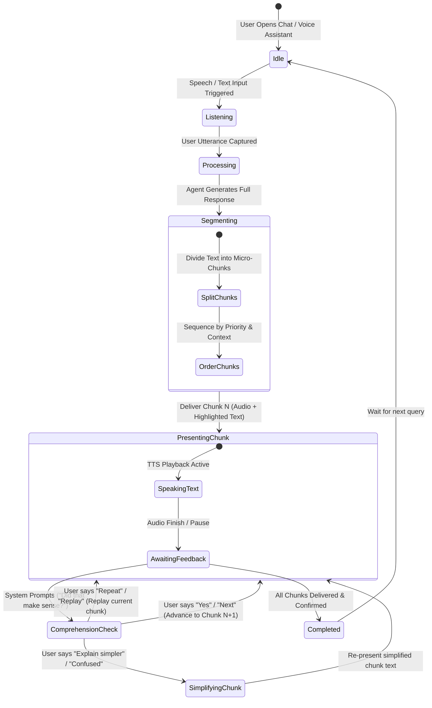
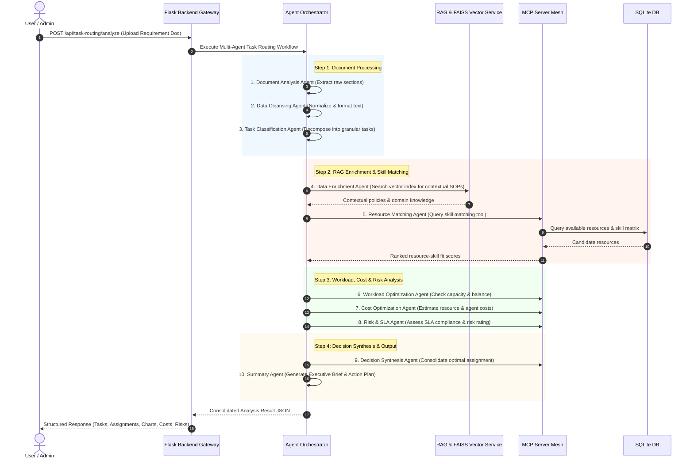
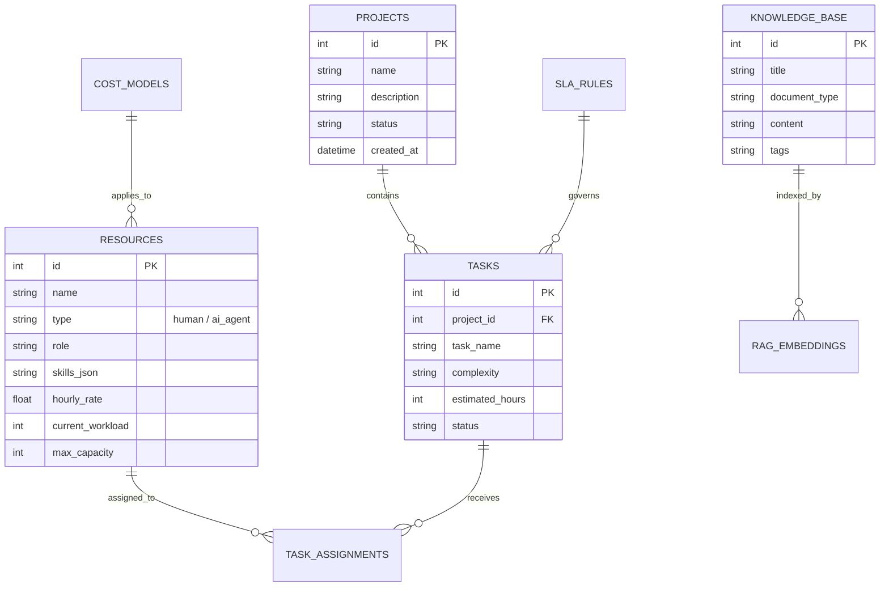

# System Architecture & Technical Specifications

## Intelligent Task Routing & Information Chunking System

---

## 1. Executive Summary & System Overview

The **Intelligent Task Routing System** is an enterprise-grade AI solution developed for the TCS AI Friday Challenge. It combines **Multi-Agent AI Orchestration**, **Model Context Protocol (MCP)** servers, and **Retrieval-Augmented Generation (RAG)** to automatically analyze project requirements documents, classify tasks, optimize resource allocations (human experts & AI agents), evaluate cost/SLA risks, and provide conversational voice/text assistance with adaptive information chunking.

---

## 2. High-Level System Architecture (System Context)

---

## 3. Data Flow & Subsystem Interaction Architecture (C4 Level 2)

---

## 4. Infrastructure & Deployment Topology Diagram

---

## 5. Voice & Information Chunking State Machine Architecture

---

## 6. Multi-Agent Execution Sequence Flow

---

## 7. Model Context Protocol (MCP) Server Specification

| MCP Server | Key Capabilities & Exposed Tools |
| :--- | :--- |
| **Resource Management** | `get_available_resources`, `get_resource_workload`, `update_workload`, `get_resource_skills` |
| **Skill Repository** | `match_skills`, `search_skills_by_category`, `get_all_skills`, `evaluate_skill_gap` |
| **Policy Management** | `search_policies`, `check_policy_compliance`, `get_escalation_rules` |
| **Expert Knowledge** | `search_expert_insights`, `get_similar_historical_tasks`, `recommend_approach` |
| **SLA Management** | `verify_sla_compliance`, `calculate_target_deadline`, `get_sla_rules` |
| **Cost Optimization** | `estimate_assignment_cost`, `calculate_agent_vs_human_cost`, `optimize_budget` |
| **Historical Performance** | `get_resource_performance_history`, `get_completion_rate`, `get_quality_score` |
| **Project Management** | `get_active_projects`, `create_project_task`, `update_task_status` |
| **Analytics** | `generate_utilization_metrics`, `get_cost_breakdown_analytics`, `get_risk_summary` |

---

## 8. Database Entity Relationship Diagram

