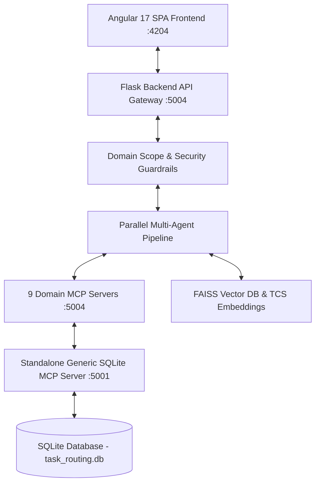

# Intelligent Task Routing & Information Chunking System

> **TCS AI Friday Season 2 Solution** — Intelligent Task Routing System with Multi-Agent AI Orchestration, Standalone Generic SQLite MCP Server (`:5001`), 9 Domain MCP Servers (`:5004`), RAG-powered Knowledge Base, and Cognitive Accessibility Voice/Text Assistant.

---

## 📚 Overview

The **Intelligent Task Routing System** addresses complex resource allocation, task classification, cost/SLA risk evaluation, and cognitive accessibility challenges. It processes unstructured requirement documents, decomposes and cleanses tasks, matches human experts & AI agents, balances workload capacities, generates Agile User Stories & 3-Sprint Execution Plans, and presents decisions with executive summaries and interactive voice/text guidance.

### Key Capabilities
- 🤖 **10-Agent Autonomous Pipeline**: Sequential and parallel agent orchestration covering document parsing, data cleansing, task classification, RAG enrichment, skill matching, workload optimization, cost optimization, risk/SLA assessment, decision synthesis, summary, and Agile project plan generation.
- 🛡️ **Two-Tier Intent & Guardrail Validation**: Evaluates queries against security rules (prompt injection, jailbreak, toxicity, SQL injection, PII masking, rate limit) and domain scope (`PrivacyGuardrail.validate_scope`). If off-topic, a polite guidance response is immediately returned to the UI. Valid inputs are categorized by `TaskIntentAgent`.
- ⚡ **Asynchronous Parallel Orchestrator**: Uses `ThreadPoolExecutor` worker pools to execute independent specialist agents (`WorkloadOptimizationAgent`, `CostOptimizationAgent`, `RiskSLAAgent`) asynchronously and in parallel.
- 🔌 **Standalone Generic SQLite MCP Server (`:5001`)**: Independent FastMCP server running on port `5001` (SSE transport) providing generic, application-agnostic database tools (`execute_query`, `execute_statement`, `execute_batch`, `list_tables`, `describe_table`). Has zero business logic and can be reused for any SQLite database across external applications.
- 🧩 **9 Domain MCP Tool Servers (`:5004`)**: Standardized tools exposing domain functions for resources, skills, policies, expert knowledge, SLAs, costs, historical performance, project management, and analytics, routing all SQL executions through the generic SQLite MCP engine.
- 🔍 **RAG & FAISS Vector Search**: Vector embedding and retrieval for company policies, SOPs, historical project documentation, and domain knowledge.
- 🗣️ **Adaptive Information Chunking Assistant**: Voice and chat interface designed in alignment with **PAS 901 Cognitive Accessibility Principles**, featuring step-by-step information chunking, interactive pacing, replay, simplification, and comprehension validation.
- 💎 **Modern Angular 17 UI**: Responsive admin dashboard, interactive task analysis workbench, chart visualizations, and Glassmorphism design aesthetics.

---

## 🏛️ System Architecture

Refer to the complete technical specifications and architectural diagrams in [ARCHITECTURE.md](file:///C:/Source/AIFriday/ARCHITECTURE.md).



---

## 🚀 Quick Start Guide

### Prerequisites
- **Python**: Version 3.10 or higher
- **Node.js**: Version 18 or higher & npm
- **OS**: Windows / Linux / macOS

---

### 1. Start Backend Server & Generic MCP Server

```bash
cd backend-mcp-task
setup.bat
start.bat
```
*Launches both the Standalone Generic SQLite MCP Server on `http://127.0.0.1:5001` and Flask Backend API on `http://localhost:5004`.*

---

### 2. Start Frontend Application

```bash
cd frontend-task-glass
setup.bat
start.bat
```
*The web interface will open at `http://localhost:4204`.*

---

## 🔐 Default Credentials

| Role | Username | Password |
| :--- | :--- | :--- |
| **Administrator** | `admin` | `admin123` |
| **Manager** | `manager` | `manager123` |
| **Resource / User** | `user` | `user123` |

---

## 📂 Project Repository Structure

```
AIFriday/
├── ARCHITECTURE.md              # Detailed System Architecture, Sequence Diagrams & ERD
├── README.md                    # Main Repository Guide
├── Question1                    # AI Friday Problem Statement Definition
├── backend-mcp-task/            # Flask Backend & MCP Server Infrastructure
│   ├── agents/                  # 10 Autonomous AI Agents, Intent Agent & Orchestrator
│   ├── mcp_servers/             # Standalone Generic SQLite MCP Server (:5001) & 9 Domain MCP Servers (:5004)
│   ├── app.py                   # Main Flask Gateway & REST API Endpoints
│   ├── database.py              # Database Gateway & Generic MCP Statement Execution
│   ├── mcp_sqlite_server.py     # Generic SQLite MCP Client Gateway
│   ├── guardrails.py            # Privacy & Domain Scope Guardrail Engine
│   ├── rag_service.py           # RAG Vector Store (FAISS) & Embeddings
│   ├── run_app.py               # Unified Launcher for Standalone MCP Server & Flask App
│   ├── task_routing.db          # SQLite Database File
│   ├── setup.bat / start.bat    # Automation Scripts
│   └── requirements.txt         # Python Dependencies
├── frontend-task-glass/         # Angular 17 Glassmorphism Frontend UI
│   ├── src/app/
│   │   ├── admin/               # Resource, Project, Task & SLA Management
│   │   ├── analysis/            # Document Upload, Task Extraction & Charts
│   │   ├── chat/                # Voice Assistant, Chunking UI & OCR
│   │   ├── login/               # Authentication Page
│   │   └── services/            # RxJS HTTP Services & API Interceptors
│   ├── setup.bat / start.bat    # Automation Scripts
│   └── package.json             # Frontend Dependencies
└── frontend-task/               # Standard Material UI Frontend Component
```

---

## 🧪 Key API Endpoints

- **POST** `/api/auth/login` — User authentication & JWT generation.
- **POST** `/api/task-routing/analyze` — Document upload, scope validation, intent classification & parallel task routing analysis pipeline.
- **POST** `/api/guardrails/validate` — Validate domain scope and prompt injection safety.
- **GET** `/api/mcp/<server>/<tool>` — Standardized domain MCP tool endpoints (e.g., `/api/mcp/resource/get_available_resources`).
- **GET** `/api/health` — System health check.

---

## 📜 Documentation Links

- 📐 **[ARCHITECTURE.md](file:///C:/Source/AIFriday/ARCHITECTURE.md)** — Architectural diagrams, sequence flows, ERD, and component specs.
- 📋 **[Question1](file:///C:/Source/AIFriday/Question1)** — Problem statement details for Information Chunking and Voice Assistants.
