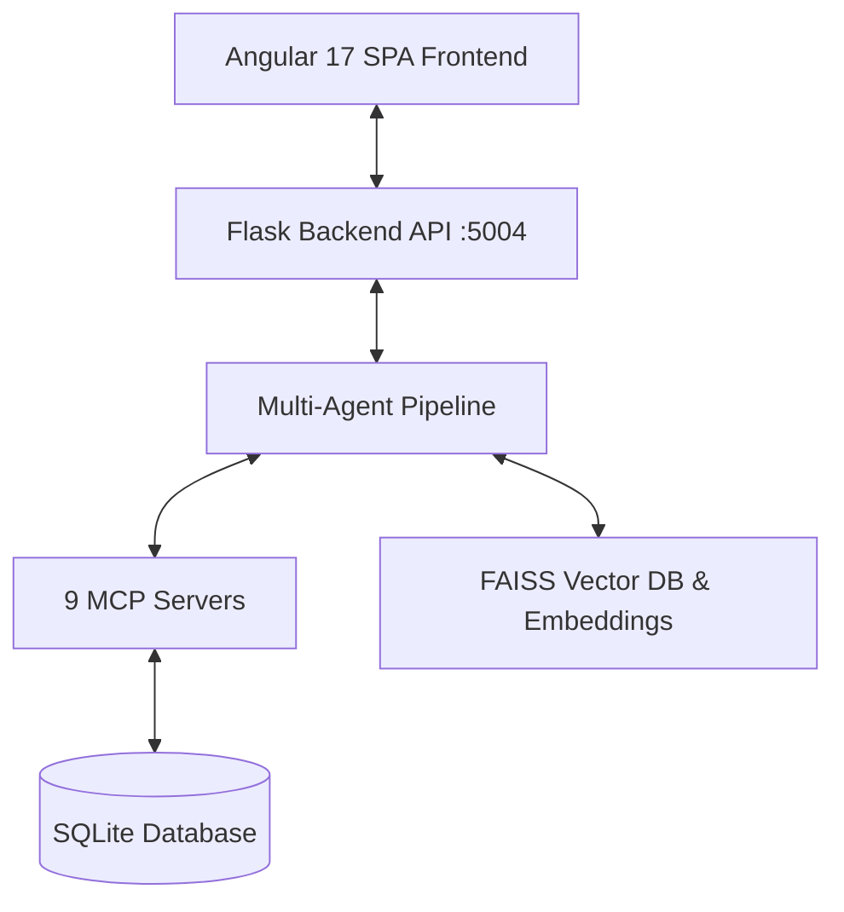

# Intelligent Task Routing & Information Chunking System

> **TCS AI Friday Season 2 Solution** — Intelligent Task Routing System with Multi-Agent AI Orchestration, 9 Model Context Protocol (MCP) Servers, RAG-powered Knowledge Base, and Adaptive Information Chunking Voice/Text Assistant.

---

## 📚 Overview

The **Intelligent Task Routing System** addresses complex resource allocation, task classification, and user comprehension challenges. It processes unstructured requirement documents, extracts & classifies tasks, matches tasks to human experts and AI agents based on skill matrices, balances workload capacities, estimates costs, verifies SLA compliance, and presents decisions with executive summaries and interactive voice/text guidance.

### Key Capabilities
- 🤖 **10-Agent Autonomous Pipeline**: Sequential and parallel agent orchestration covering document parsing, data cleansing, task classification, RAG enrichment, skill matching, workload optimization, cost optimization, risk/SLA assessment, decision synthesis, and executive summarization.
- 🔌 **9 Model Context Protocol (MCP) Servers**: Standardized tools exposing domain functionality for resources, skills, policies, expert knowledge, SLAs, costs, historical performance, project management, and analytics.
- 🔍 **RAG & FAISS Vector Search**: Vector embedding and retrieval for company policies, SOPs, historical project documentation, and domain knowledge.
- 🗣️ **Adaptive Information Chunking Assistant**: Voice and chat interface designed in alignment with **PAS 901 Cognitive Accessibility Principles**, featuring step-by-step information chunking, interactive pacing, replay, simplification, and comprehension validation.
- 💎 **Modern Angular 17 UI**: Responsive admin dashboard, interactive task analysis workbench, chart visualizations, and Glassmorphism design aesthetics.

---

## 🏛️ System Architecture

Refer to the complete technical specifications and architectural diagrams in [ARCHITECTURE.md](file:///C:/Source/AIFriday/ARCHITECTURE.md).



---

## 🚀 Quick Start Guide

### Prerequisites
- **Python**: Version 3.10 or higher
- **Node.js**: Version 18 or higher & npm
- **OS**: Windows / Linux / macOS

---

### 1. Start Backend Server

```bash
cd backend-mcp-task
setup.bat
start.bat
```
*The backend API will run on `http://localhost:5004`.*

---

### 2. Start Frontend Application

```bash
cd frontend-task-glass
setup.bat
start.bat
```
*The web interface will open at `http://localhost:4204`.*

---

## 🔐 Default Credentials

| Role | Username | Password |
| :--- | :--- | :--- |
| **Administrator** | `admin` | `admin123` |
| **Manager** | `manager` | `manager123` |
| **Resource / User** | `user` | `user123` |

---

## 📂 Project Repository Structure

```
AIFriday/
├── ARCHITECTURE.md              # Detailed System Architecture & Diagrams
├── README.md                    # Main Repository Guide
├── Question1                    # AI Friday Problem Statement Definition
├── backend-mcp-task/            # Flask Backend Server
│   ├── agents/                  # 10 Autonomous AI Agents & Orchestrator
│   ├── mcp_servers/             # 9 Model Context Protocol (MCP) Servers
│   ├── app.py                   # Main Flask Gateway & API Endpoints
│   ├── database.py              # SQLite Database Initializer & Schemas
│   ├── rag_service.py           # RAG Vector Store (FAISS) & Embeddings
│   ├── task_routing.db          # SQLite Database File
│   ├── setup.bat / start.bat    # Automation Scripts
│   └── requirements.txt         # Python Dependencies
├── frontend-task-glass/         # Angular 17 Glassmorphism Frontend UI
│   ├── src/app/
│   │   ├── admin/               # Resource, Project, Task & SLA Management
│   │   ├── analysis/            # Document Upload, Task Extraction & Charts
│   │   ├── chat/                # Voice Assistant, Chunking UI & OCR
│   │   ├── login/               # Authentication Page
│   │   └── services/            # RxJS HTTP Services & API Interceptors
│   ├── setup.bat / start.bat    # Automation Scripts
│   └── package.json             # Frontend Dependencies
└── frontend-task/               # Standard Material UI Frontend Component
```

---

## 🧪 Key API Endpoints

- **POST** `/api/auth/login` — User authentication & JWT generation.
- **POST** `/api/task-routing/analyze` — Document upload & multi-agent task routing analysis pipeline.
- **GET** `/api/mcp/<server>/<tool>` — Standardized MCP tool endpoints (e.g., `/api/mcp/resource/get_available_resources`).
- **GET** `/api/health` — System health check.

---

## 📜 Documentation Links

- 📐 **[ARCHITECTURE.md](file:///C:/Source/AIFriday/ARCHITECTURE.md)** — Architectural diagrams, sequence flows, ERD, and component specs.
- 📋 **[Question1](file:///C:/Source/AIFriday/Question1)** — Problem statement details for Information Chunking and Voice Assistants.
