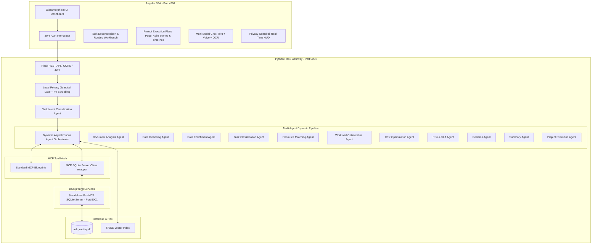

# AIFriday Task Routing Master Blueprint: Angular + Flask + MCP SQLite + Privacy Guardrails + Dynamic Intent Orchestration

This skill provides a complete, reusable architecture blueprint for the AIFriday Intelligent Task Routing application. It documents the end-to-end multi-agent workflow, background FastMCP SQLite tool servers, privacy guardrail validation, intent classification, dynamic asynchronous agent dispatching, and UI integration patterns.

---

## 🏛️ 1. Architecture & System Overview



---

## 🧠 2. Intent Classification Taxonomy & Routing Matrix

The `TaskIntentAgent` classifies incoming queries and documents into six domain categories, allowing the `AgentOrchestrator` to dynamically dispatch only the necessary specialist agents asynchronously:

| Intent Category | Triggers & Keywords | Dispatched Asynchronous Agents | Output Response Payload |
|---|---|---|---|
| `FULL_TASK_ROUTING_ANALYSIS` | Multiline requirements, `Task 1:`, `task routing`, `analyze document` | `DocumentAnalysis` $\rightarrow$ `DataCleansing` $\rightarrow$ `DataEnrichment` $\rightarrow$ `TaskClassification` $\rightarrow$ `ResourceMatching` $\rightarrow$ Parallel `[WorkloadOpt, CostOpt, RiskSLA]` $\rightarrow$ `Decision` $\rightarrow$ `Summary` | Executive Task Matrix, Allocation Reasoning, SLA/Cost Analytics, Audit Logs |
| `EXECUTION_PLAN_GENERATION` | `execution plan`, `user story`, `sprint plan`, `roadmap`, `story points` | `ProjectExecutionAgent` | Agile User Story Table (`US-101`), Story Points, Effort Hours, Cost, 3-Sprint Roadmap |
| `RESOURCE_MATCHING_INQUIRY` | `find resource`, `developer availability`, `who can do`, `match skills` | `DocumentAnalysis` $\rightarrow$ `ResourceMatching` $\rightarrow$ Parallel `[WorkloadOpt]` | Top Ranked Human Resources & AI Agents with Quality & Workload Scores |
| `COST_SLA_OPTIMIZATION` | `cost optimization`, `sla risk`, `hourly rate`, `budget limit` | Parallel `[CostOptimizationAgent, RiskSLAAgent]` $\rightarrow$ `SummaryAgent` | Cost-per-Hour Breakdown, Risk Scores, SLA Penalty Warnings |
| `POLICY_FAQ_INQUIRY` | `policy`, `compliance`, `sla rules`, `terms`, `privacy` | `SummaryAgent` (with FAISS RAG Context) | Verified Corporate Policy Guidelines & Escalation Criteria |
| `GENERAL_ASSISTANT_CONVERSATION` | Greetings (`hi`, `hello`), thanks, general questions | `SummaryAgent` | Conversational Markdown Response with Action Chips |

---

## ⚡ 3. Dynamic Asynchronous Agent Dispatching (`orchestrator.py`)

The `AgentOrchestrator` evaluates input text and executes parallel-capable agents asynchronously using `ThreadPoolExecutor`:

```python
class AgentOrchestrator:
    def execute_dynamic_intent_flow(self, initial_context: Dict[str, Any], text_query: str, callback=None) -> Dict[str, Any]:
        intent_result = task_intent_agent.classify(text_query)
        intent = intent_result['intent']
        initial_context['_classified_intent'] = intent_result

        # Dynamic Pipeline Construction based on Intent
        if intent == 'EXECUTION_PLAN_GENERATION':
            final_agents = [ProjectExecutionAgent()]
        elif intent == 'RESOURCE_MATCHING_INQUIRY':
            sequential_agents = [DocumentAnalysisAgent(), ResourceMatchingAgent()]
            parallel_agents = [WorkloadOptimizationAgent()]
        elif intent == 'COST_SLA_OPTIMIZATION':
            parallel_agents = [CostOptimizationAgent(), RiskSLAAgent()]
            final_agents = [SummaryAgent()]
        else:
            # Full 10-Agent Pipeline
            sequential_agents = [DocumentAnalysisAgent(), DataCleansingAgent(), DataEnrichmentAgent(), TaskClassificationAgent(), ResourceMatchingAgent()]
            parallel_agents = [WorkloadOptimizationAgent(), CostOptimizationAgent(), RiskSLAAgent()]
            final_agents = [DecisionAgent(), SummaryAgent()]

        return self.execute_custom_flow(initial_context, sequential_agents, parallel_agents, final_agents, callback)
```

---

## 🛡️ 4. Zero-PII Privacy Guardrail Specifications

All chat messages and task analysis documents pass through `PrivacyGuardrail`:

1. **PII Scrubbing Regex Patterns**:
   - `Emails`: `[ANON_EMAIL_1]`
   - `IPv4 / IPv6`: `[ANON_IP_1]`
   - `Secrets / Tokens`: `[REDACTED_SECRET_1]`
   - `PAN Cards`: `[REDACTED_PAN_1]`
   - `Aadhaar Numbers`: `[REDACTED_AADHAAR_1]`
   - `Phone Numbers`: `[REDACTED_PHONE_1]`
2. **Prompt Injection Defense**: Neutralizes `ignore previous instructions`, `system prompt`, `jailbreak`.
3. **Domain Scope Check**: Validates project routing scope (`validate_scope()`).

---

## 📋 5. Project Execution Plans & SQLite Database Schema

Execution plans generated via button click or chat are stored in `project_execution_plans` table:

```sql
CREATE TABLE IF NOT EXISTS project_execution_plans (
    plan_id INTEGER PRIMARY KEY AUTOINCREMENT,
    plan_name TEXT NOT NULL,
    description TEXT,
    source TEXT DEFAULT 'Task Routing Analysis',
    total_user_stories INTEGER NOT NULL DEFAULT 0,
    total_story_points INTEGER NOT NULL DEFAULT 0,
    total_effort_hours REAL NOT NULL DEFAULT 0,
    total_cost REAL NOT NULL DEFAULT 0,
    sprint_count INTEGER NOT NULL DEFAULT 1,
    start_date TEXT,
    target_end_date TEXT,
    user_stories_json TEXT NOT NULL,
    timeline_json TEXT NOT NULL,
    team_allocation_json TEXT,
    created_at TIMESTAMP DEFAULT CURRENT_TIMESTAMP
);
```

---

## 🚀 6. Verification Checklist

- [x] FastMCP SQLite server online on port 5001 (`http://127.0.0.1:5001/sse`).
- [x] Privacy Guardrail scrub metrics & anonymization table active in Chat and Analysis.
- [x] Intent Classification Agent (`TaskIntentAgent`) classifying inputs dynamically.
- [x] Asynchronous parallel execution via `ThreadPoolExecutor` and SSE streaming.
- [x] Agile Project Execution Plans page (`/execution-plans`) displaying User Stories, Fibonacci points, effort hours, cost, and 3-sprint Gantt roadmap.
- [x] Production Angular build compiling cleanly (`√ Browser application bundle generation complete`).
